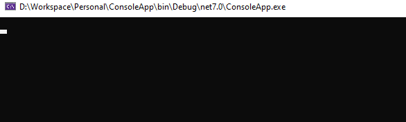
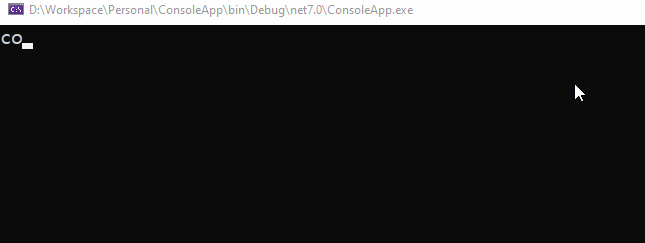
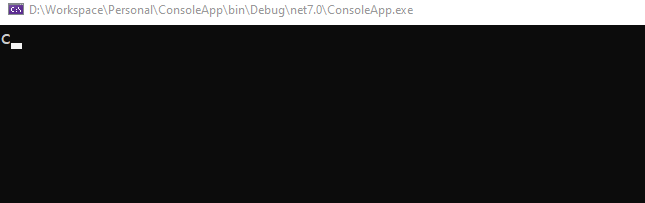

# Strings, numbers and data input/output in C# console applications

`By Rafael Osipov, Last Updated on Aug 12, 2023`

## Print to the console window

To print something to the console window, you can use `Console.Write()` and `Console.WriteLine()` calls.

Since `Console.Write()` writes something to the console window, it does not change the current cursor position. And the next call to `Console.Write()` or `Console.WriteLine()` will print the text on the same line.

For example, the following code:

```c#
Console.Write("The first call");
Console.Write("The second call");
```

Will print:

```
The first callThe second call
```

Check out the following slow-motion video of the running code and note that the starting point of the second string will be printed.


`Console.WriteLine()` works in the same way as `Console.Write()`, but it moves the cursor to the next line when the printing is finished.

For example, the following code:

```c#
Console.WriteLine("The first call");
Console.WriteLine("The second call");
```

will print

```
The first call
The second call
```

Check out the following slow-motion video of the running code and note that the starting point of the second string will be printed.


You can combine `Console.Write()` and `Console.WriteLine()` calls for complex text output.

If you call `Console.WriteLine()` without parameters, it will print a blank line of text. In other words, just move the cursor to the next line without printing anything.

For example:

```c#
Console.WriteLine("The first call");
Console.WriteLine(); // calling without parameters
Console.WriteLine("The second call");
```
Note the blank line between "The first call" and "The second call" in the slow motion video below.


## Reading of user input from the keyboard

Use the `Console.ReadLine()` call to enter a line of text from the keyboard.

Since `Console.ReadLine()` only accepts a value from the keyboard without first displaying anything on the screen, we use `Console.Write()` to display the prompt before typing. 

For example, the following code displays a prompt to enter a string, then accepts a string from the keyboard and displays it on the screen.

```c#
// Note that we use Console.Write(), not Console.WriteLine(), so that the cursor doesn't move after the prompt is printed.
Console.Write("Enter a string: ");

// Declare a string variable and immediately assign the string entered from the keyboard to it.
string enteredString = Console.ReadLine();

// Display the string you just typed on the keyboard.
Console.WriteLine(enteredString);
```
The slow motion video below shows how this code will work:


### Type conversion for input data

In cases where we need to get a numeric value from the keyboard, we need an additional step. Since `Console.ReadLine()` gives us a string as a result of its work, we need to convert this string to a number.

To convert the entered string to `int` type, use `Convert.ToInt32()`. This method has a disadvantage: if the string you entered cannot be converted to a number, your program will terminate with an error message. In C# there is a way to check the string for correctness, we will consider this method later. For now, we will assume that correct values are always entered from the keyboard.

In this example, we will enter two numbers from the keyboard, add them, and display the result.

```c#
Console.Write("Enter the first number: ");
string firstNumberAsText = Console.ReadLine();

Console.Write("Enter the second number: ");
string secondNumberAsText = Console.ReadLine();

// At this point, we have firstNumberAsText and secondNumberAsText variables with text inside.
// To perform numeric-related operations on the input data, we need to convert that data to numeric types.

int firstNumber = Convert.ToInt32(firstNumberAsText);
int secondNumber = Convert.ToInt32(secondNumberAsText);

// Now we have two integer type values

// Sum calculation
int totalSum = firstNumber + secondNumber;

// Displaying result
Console.Write("The sum of the numbers entered is ");
Console.WriteLine(totalSum);
```

The slow motion video below shows how this code will work:


## Strings

### Empty string validation

To check if the entered string contains anything or only whitespace, use the `string.IsNullOrWhiteSpace()` call.

For example:

```c#
Console.Write("Enter full name: ");
string fullName = Console.ReadLine();

if (string.IsNullOrWhiteSpace(fullName))
{
    // if fullName is empty
    Console.WriteLine("You did not enter a full name");
}
else
{
    // if fullName is not empty
    Console.Write("Hello ");
    Console.WriteLine(fullName);
}
```

Examples of how this code works for cases are shown below:

If full name contains only spaces:



If full name is empty:


If full name is provided correctly:


### Special symbols

You can insert special characters into the string that affect the behavior of the cursor during printing. For example, a `\n` character inserted in a line will cause the cursor to automatically move to the next line when it reaches that character and continue printing from the next line on the display. And the `\t` character inserts a tab character, which allows you to align the text displayed on the screen by columns.

The following code prints the `first line`, `second line`, and `third line` parts of someString variable on separate lines.

```c#
string someString = "first line\nsecond line\nthird line";
Console.WriteLine(someString);
```
The following slow-motion video shows this code in action:


The code below demonstrates the use of the `\t` character within a header string and a value string.

```c#
string headerString = "col1\tcol2\tcol3";
string valueString = "35\t29\t17";
Console.WriteLine(headerString);
Console.WriteLine(valueString);
```



Special characters can be combined within a string to accomplish your tasks. The example below shows the combined use of the `\n` and `\t` characters for formatted output of a small table to the console.

```c#
string headerString = "col1\tcol2";
string valueString = "10\t20\n30\t40\n50\t60"; // combining \t and \n here
Console.WriteLine(headerString);
Console.WriteLine(valueString);
```

The following slow-motion video shows how this code works:




### Interpolated strings

In C#, you can embed variables and expressions within strings. These strings are called "interpolated strings". At the beginning of an interpolated string, put a `$` sign.

Below are examples of the application of interpolated strings:

```c#
string fullName = "El Sid";
string greetingText = $"Hello {fullName}";
Console.WriteLine(greetingText); // this line will print: Hello El Sid
```

```c#
int distance = 1200;
string distanceReport = $"The distance is {distance} meters";
Console.WriteLine(distanceReport); // this line will print: The distance is 1200 meters
```
It is possible to embed as many variables in string as you deem necessary for your task.

For example:

```c#
int firstSum = 100;
int secondSum = 200;
int thirdSum = 300;

string report = $"First sum: {firstSum}, Second sum: {secondSum}, Third sum: {thirdSum}";
```

### Combination of multiple string variables at run time

In some cases there is a need to "glue" the values of several string variables and variables of other types into one string. The simplest thing that comes to mind is a code like this:

```c#
string resultString = someString + anotherString + thirdString;
```

This is not the best way to concatenate the values of different variables into a single string. Since a string is an immutable object, any + operation on string variables will create additional string objects in memory containing the result of that addition. The effect will be particularly unpleasant in terms of memory consumption if you do concatenation with + in a loop.

Let's imagine a situation when we need to form a string containing all numbers from 0 to 999 without separators.

```c#
// BAD APPROACH

string resultString = "";
for (int i = 0; i < 1000; i++)
{
    resultString = resultString + i;
}

Console.WriteLine(resultString);
```

String object is immutable. And each time we perform an operation + "gluing" strings with strings and other data in a loop, additional objects are created in memory to store the results of this "gluing" at each iteration. Thus, this approach will generate a large number of string objects in memory, which can be a serious problem when processing large amounts of data.

To avoid this, it is recommended to use `StringBuilder`.

Below is an example that solves the same problem as the code above, but in the right way.

```c#
// GOOD APPROACH

using System.Text;

StringBuilder stringBuilder = new();
for (int i = 0; i < 1000; i++)
{
    stringBuilder.Append(i);
}

string resultString = stringBuilder.ToString();

Console.WriteLine(resultString);
```

Learn more about strings and string operations in C# here: https://learn.microsoft.com/en-us/dotnet/csharp/programming-guide/strings/
