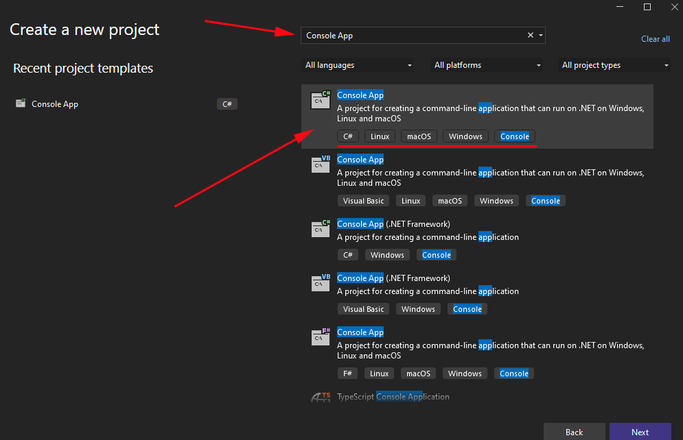
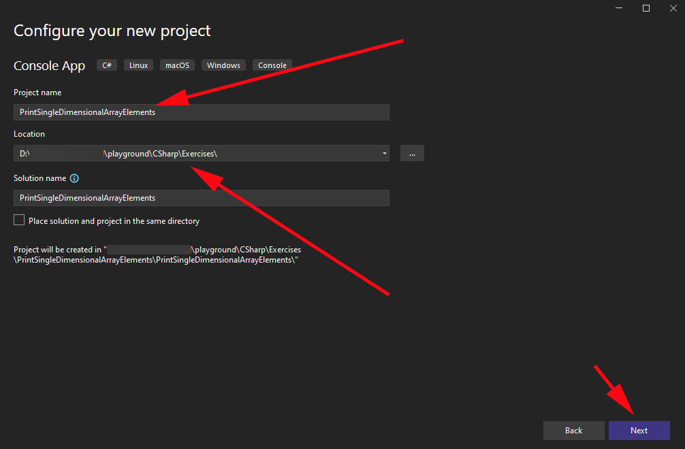
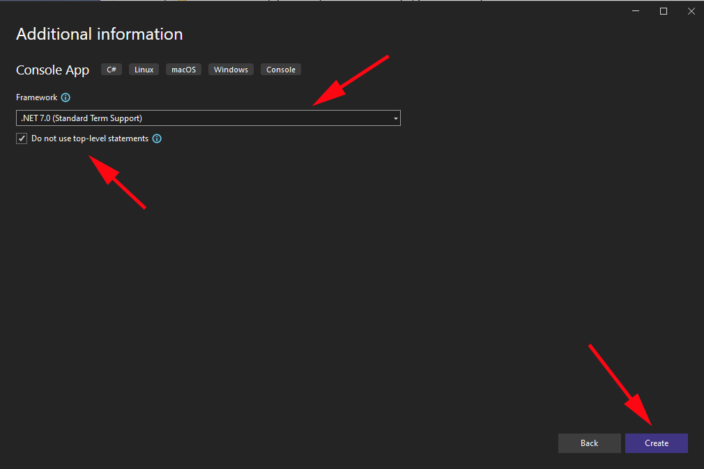
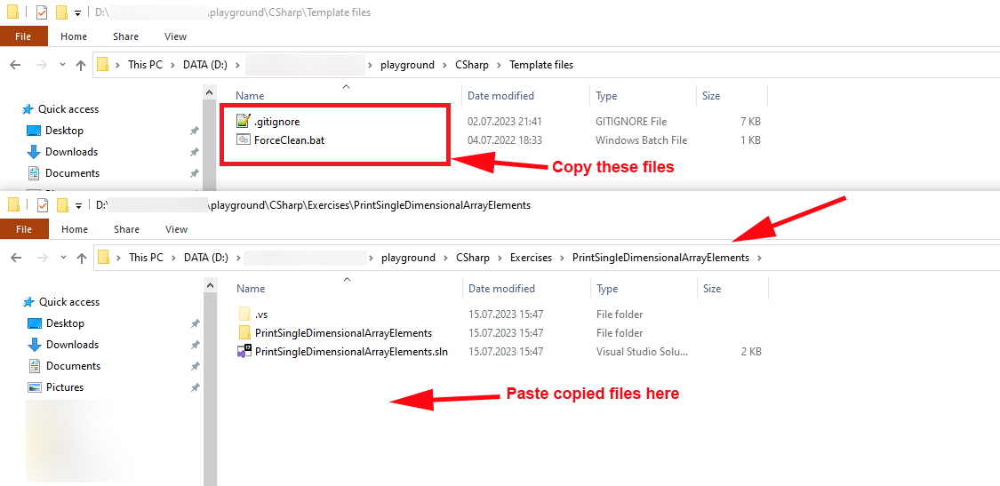
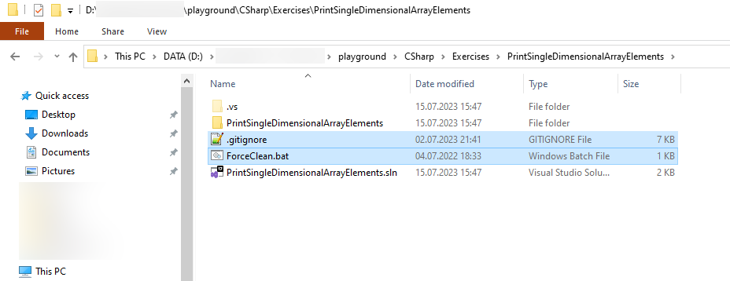
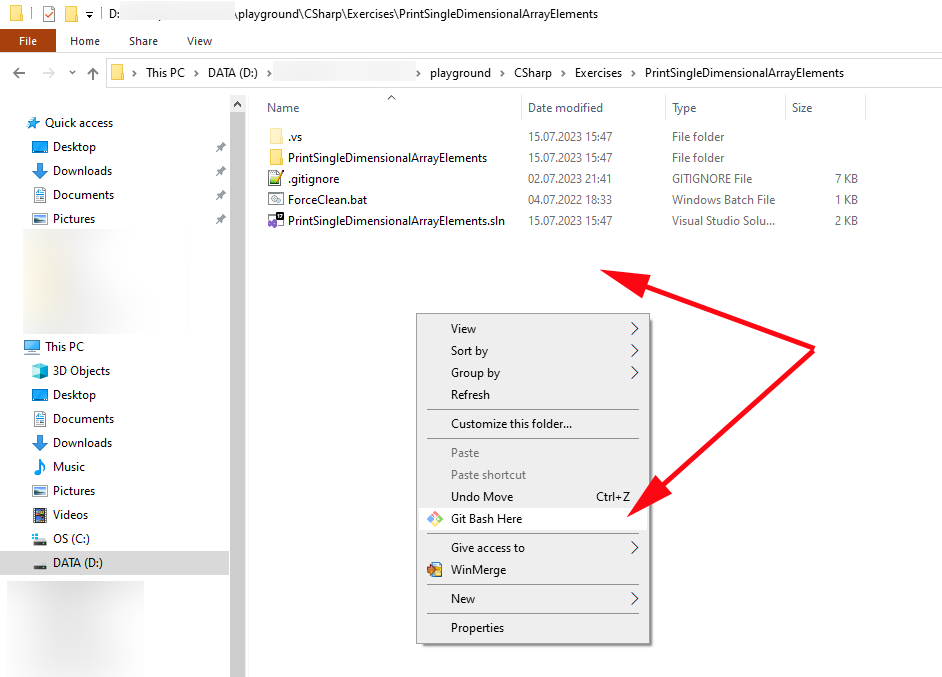
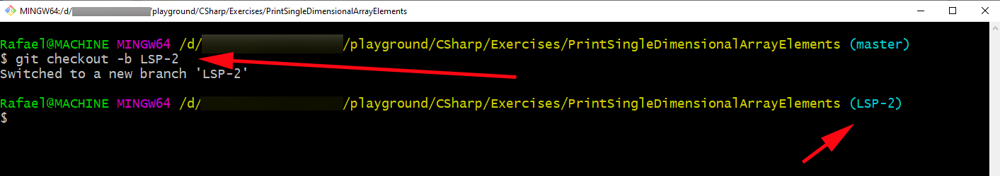

# How to create console project in Visual Studio 2022

1.Launch Visual Studio 2022 and select "Create new project"

2.Type `Console App` in the search box, select `Console App` template and click `Next` button on the right bottom corner of the window.

3.Select `Playground/Exercises` folder and specify project name (without spaces) and click `Next` button on the right bottom corner of the window.

4.Specify the most recent .NET version, today it is .NET 7.0, and enable `Do not use top-level statements`, then click `Create` button.

5.Launch `File Explorer` and navigate to `playground/CSharp/Template files`, and copy all files from that folder to the solution folder of the project you've just created.

Copied files looks like that:

`ForceClean.bat` created to do Visual Studio Build-Clean job, but does it better.

6.Open `Git Bash` window in the just created solution folder.

7.Create new branch with the same name as your task id in JIRA:

8.Return to Visual Studio and start writing code, when it is done, commit changes to the current branch and make pull request to master in [https://github.com/cdefgah/playground](https://github.com/cdefgah/playground)
