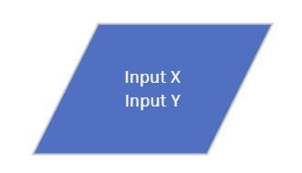
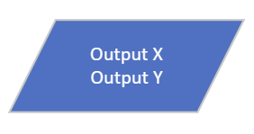
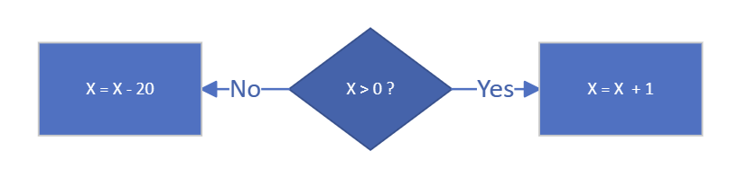
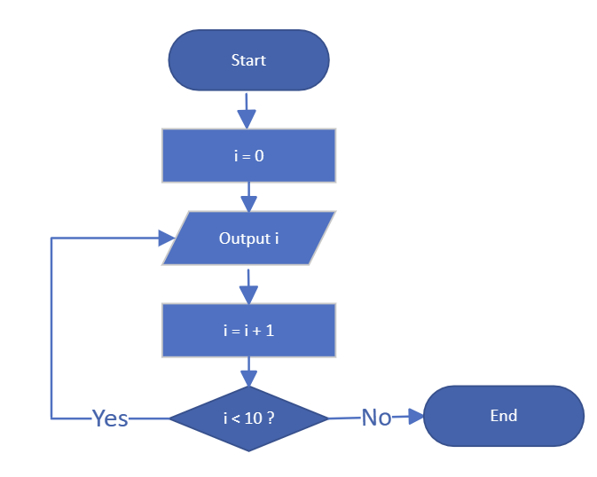
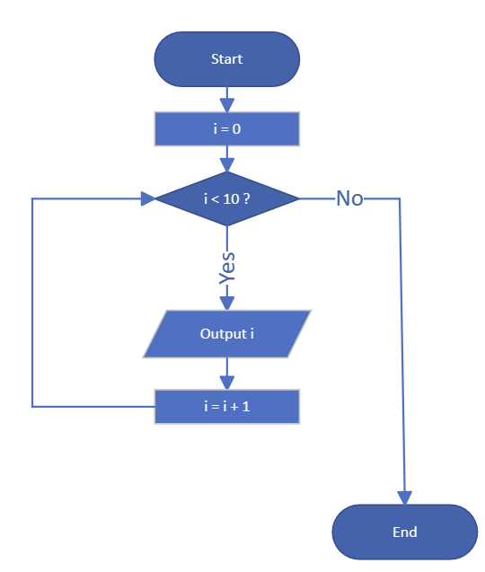

# Relationship between flowchart and code

`By Rafael Osipov, Last Updated on Aug 12, 2023`

Strictly speaking, according to the standard, block diagrams use a large number of different block types for certain actions. However, for the sake of simplicity, I will simplify and give block types for only the most basic operations.


A parallelogram is used to indicate a data entry operation



Similar to the flowchart code for C#:

```c#
int X =  Convert.ToInt32(Console.ReadLine());
int Y =  Convert.ToInt32(Console.ReadLine());
```

A parallelogram is also used to specify the data output



Similar to the flowchart code for C#:

```c#
Console.WriteLine($"X = {X}");
Console.WriteLine($"Y = {Y}");
```

A rectangle is used to indicate the execution of an operation, such as calculating or assigning values to variables.


Similar to the flowchart code for C#:

```c#
X = 29;
```

A rhombus is used to indicate that a condition has been checked.



Similar to the flowchart code for C#:

```c#
if (X > 0)
{
    X = X + 1;
}
else
{
    X = X - 20;
}
```

The diagram below shows the implementation of the loop for the variable i from 0 to 9 inclusive. At each iteration of this loop, we output the value of i.



This is known as a post-conditioned loop. The condition for continuing the loop is at the end of the iteration.

Similar to the flowchart code for C#:

```c#
int i = 0;
do
{
    Console.WriteLine($"i = {i}");
    
    i = i + 1;

} while (i < 10);
```

The block diagram of an example loop of the same type, but with a precondition, will look like this:



Similar to the flowchart code for C#:

`While` loop example:

```c#
int i = 0;
while (i < 10)
{
    Console.WriteLine($"i = {i}");
    
    i = i + 1;
}
```

`For` loop example:

```c#
for (int i = 0; i < 10; i++)
{
    Console.WriteLine($"i = {i}");
}
```