# How to count the number of sequences in an array

`By Rafael Osipov, Last Updated on Aug 13, 2023`

This task is similar to the task of counting words in a string. Once you understand how to solve this problem, you will be able to solve a whole series of similar problems involving the processing of sequences in data arrays.

Let's imagine we have a box with cells numbered from 0 to 11. And this box is filled with a sequences of candies with pods of hot peppers in between them.

A sequence is a candy chain of any length that is separated from another candy chain by a pepper or by the borders of a box.

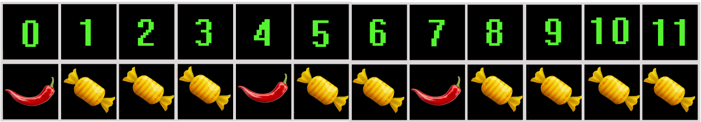

We will go through the contents of the box from number 0 to number 11. When the candy sequence starts, we turn on the lamp and it stays on until we turn it off. And we turn it off when the candy sequence ends. The important point is that the lamp does not turn on or off by itself. We turn it on and off ourselves.

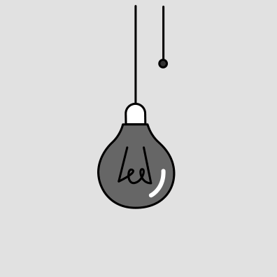

To count the number of sequences found, we will use a clicker counter.

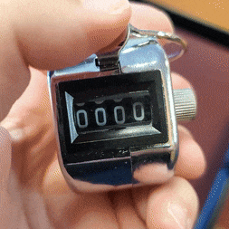

## Before we start

Before we start, we'll turn off the lamp because we haven't come across any completed candy sequences yet. We will also set the clicker counter to zero.

| Lamp status | Number on the  clicker counter |
|-------------|--------------------------------|
| Off         | 0                              |

Let's begin ...

## Item with index 0

We have a look at the contents of the very first cell in the box, its index is zero. And in this cell we have a hot pepper pod, not a candy.

We encountered content that is not part of the sequence we need, but is a delimiter. We check the status of the lamp, if it is on, it means that we went through the candy sequence before processing this cell. In this case, the pepper pod that we encountered will mean the end of the candy sequence. But in our case, the lamp is off and we simply move on to the next item without changing the state of the lamp or the state of the clicker counter.

| Lamp status | Number on the  clicker counter |
|-------------|--------------------------------|
| Off         | 0                              |

## Item with index 1

Now we move to the next item in the box whose index is 1. And in this cell of the box there is a candy.

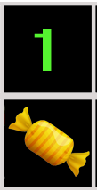

Once we see the candy in the box, we check the status of the lamp. It's off. 

This means that before we started processing this drawer cell with the candy in it, we were not in the candy sequence. 

**So this candy is the start of the sequence.**

We turn on the lamp. But we don't touch the clicker counter until the candy sequence ends with either the pepper pod or the end of the box.

| Lamp status | Number on the  clicker counter |
|-------------|--------------------------------|
| On          | 0                              |

## Item with index 2

Go to the next cell in the box, its index is 2.

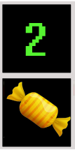

There is a candy bar in this cell of the box. 

Check the status of the lamp. 

It's on. 

This means we are in the candy sequence. 

Just go to the next cell of the box. We don't touch the lamp or the click counter.

| Lamp status | Number on the  clicker counter |
|-------------|--------------------------------|
| On          | 0                              |

## Item with index 3

Go to the next cell in the box, its index is 3.

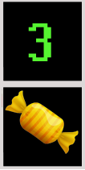

There is a candy bar in this cell of the box. 

Check the status of the lamp. 

It's on. 

This means we are in the candy sequence. 

Just go to the next cell of the box. We don't touch the lamp or the click counter.

| Lamp status | Number on the  clicker counter |
|-------------|--------------------------------|
| On          | 0                              |

## Item with index 4

Go to the next cell in the box, its index is 4.

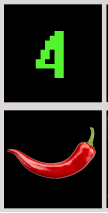

So we have a pepper pod. Here's what we're going to do.

See if the lamp is on. And it's on. 

This means that we were in the candy sequence before this cell. And when we hit the pepper pod in this cell, we realize that the candy sequence has ended. 

We turn off the lamp. 

And we increase the clicker counter by one. 

| Lamp status | Number on the  clicker counter |
|-------------|--------------------------------|
| Off         | 1                              |

## Item with index 5

Go to the next cell in the box, its index is 5.  And in this cell of the box there is a candy.

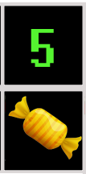

Once we see the candy in the box, we check the status of the lamp. It's off. 

This means that before we started processing this drawer cell with the candy in it, we were not in the candy sequence. 

**So this candy is the start of the new sequence.**

We turn on the lamp. But we don't touch the clicker counter until the candy sequence ends with either the pepper pod or the end of the box.

| Lamp status | Number on the  clicker counter |
|-------------|--------------------------------|
| On          | 1                              |

At the moment, the lamp is on, which means we are in the candy sequence. And the clicker counter tells us how many sequences we have found so far (one). The current candy sequence we are in has no effect on this counter. The counter will change when we finish moving through this candy sequence, either by hitting a pepper pod or by stopping at the end of a box.

## Item with index 6

Go to the next cell in the box, its index is 6.  And in this cell of the box there is a candy.

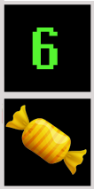

Check the status of the lamp. 

It's on. 

This means we are in the candy sequence. 

Just go to the next cell of the box. We don't touch the lamp or the click counter.

| Lamp status | Number on the  clicker counter |
|-------------|--------------------------------|
| On          | 1                              |

## Item with index 7

Go to the next cell in the box, its index is 7. And in this cell of the box there is pepper pod.

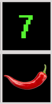

So we have a pepper pod. Here's what we're going to do.

See if the lamp is on. And it's on. 

This means that we were in the candy sequence before this cell. And when we hit the pepper pod in this cell, we realize that the candy sequence has ended. 

We turn off the lamp. 

And we increase the clicker counter by one. 

| Lamp status | Number on the  clicker counter |
|-------------|--------------------------------|
| Off         | 2                              |

## Item with index 8

Go to the next cell in the box, its index is 8.  And in this cell of the box there is a candy.

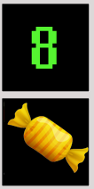

Once we see the candy in the box, we check the status of the lamp. It's off. 

This means that before we started processing this drawer cell with the candy in it, we were not in the candy sequence. 

**So this candy is the start of the new another sequence.**

We turn on the lamp. But we don't touch the clicker counter until the candy sequence ends with either the pepper pod or the end of the box.

| Lamp status | Number on the  clicker counter |
|-------------|--------------------------------|
| On          | 2                              |

## Item with index 9

Go to the next cell in the box, its index is 9.  And in this cell of the box there is a candy.

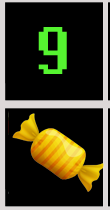

There is a candy in this cell of the box. 

Check the status of the lamp. 

It's on. 

This means we are in the candy sequence. 

Just go to the next cell of the box. We don't touch the lamp or the click counter.

| Lamp status | Number on the  clicker counter |
|-------------|--------------------------------|
| On          | 2                              |

## Item with index 10

Go to the next cell in the box, its index is 10.

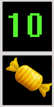

There is a candy in this cell of the box. 

Check the status of the lamp. 

It's on. 

This means we are in the candy sequence. 

Just go to the next cell of the box. We don't touch the lamp or the click counter.

| Lamp status | Number on the  clicker counter |
|-------------|--------------------------------|
| On          | 2                              |

## Item with index 11

Go to the next cell in the box, its index is 11.  And in this cell of the box there is a candy.

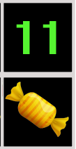

There is a candy in this cell of the box. 

Check the status of the lamp. 

It's on. 

This means we are in the candy sequence. 

Just go to the next cell of the box. We don't touch the lamp or the click counter.

| Lamp status | Number on the  clicker counter |
|-------------|--------------------------------|
| On          | 2                              |

## The end of the box is reached

Since the end of the box has been reached, we consider this event to be equivalent to the encounter of a divider (pepper pod).

See if the light is on. And it's on. 

This means that we were in the candy sequence in the last cell of the box. And when we reach the end of the box, we realize that the candy sequence is over. 

We turn off the lamp. 

And we increase the clicker counter by one.

If the lamp had been off when the box cells were completed, we would not have increased the sequence counter by one.

| Lamp status | Number on the  clicker counter |
|-------------|--------------------------------|
| Off         | 3                              |

As a result we get the desired number of candy sequences and it is three.

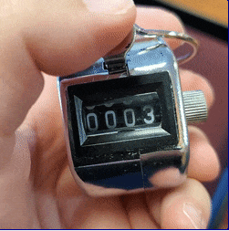
